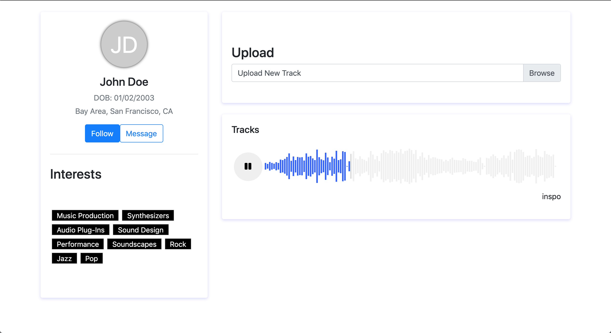

# User Info Demo App
## Getting started
### Requirments
[Node and NPM](https://nodejs.org/en/)
### Install
To install required packages run the following commands in order in the root project directory. 
 ```
$ npm install
$ (cd client && npm install)
 ```

### Run
To run the app run the following command in the root project directory.
```
$ npm run dev
```

### App preview:
